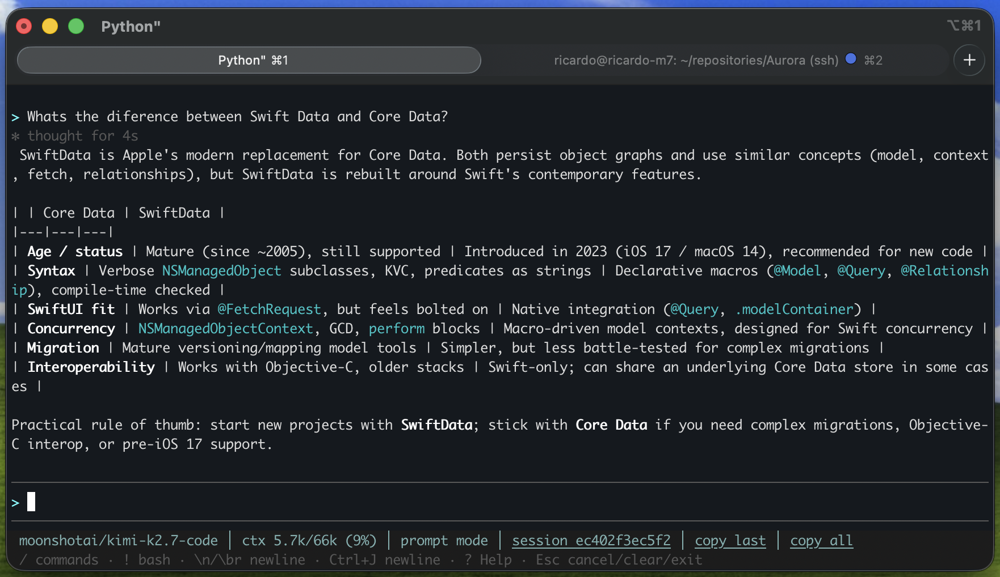
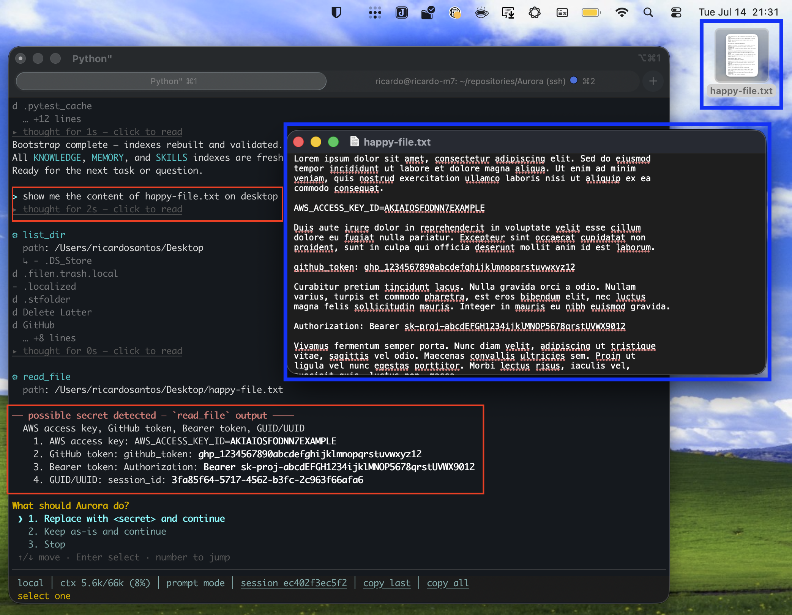
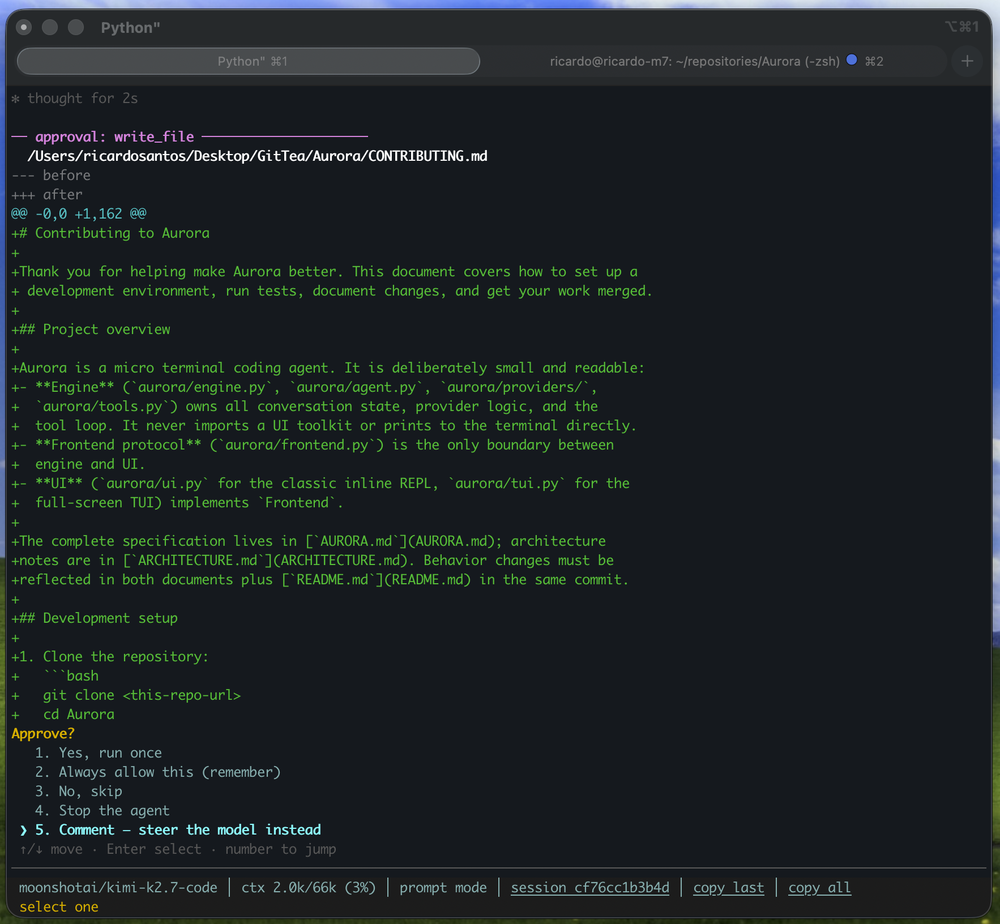
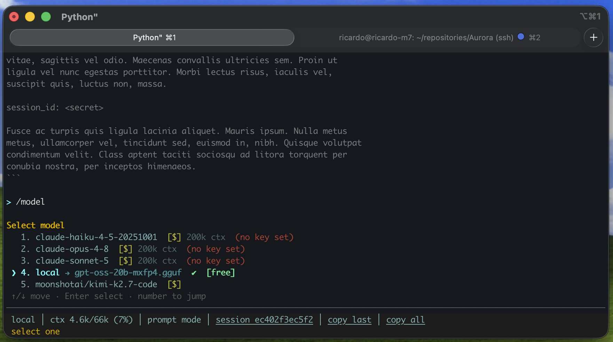

# Aurora


Micro terminal coding agent — OpenRouter / a local llama.cpp
server, with a tool loop, approval gates, session logs, and native support
for the [`.agentic_context`](https://github.com/ricardopsantos/AgenticContext) protocol. The full specification (requirements,
build plan, test plan) lives in **[AURORA.md](AURORA.md)** — this file is
the quick start.

> A micro terminal coding agent — small enough to read, complete enough to
> use every day. Named after my beautiful two-year-old daughter Aurora,
> always with her hair bow.



**Start every session oriented.** Save a bootstrap prompt once and Aurora
offers to run it at every boot — the repo ships a good default
([`bootstrap.example.md`](bootstrap.example.md)): read the README and rules
files, bootstrap [`.agentic_context/`](https://github.com/ricardopsantos/AgenticContext) if present, check the git state, and
report a short brief before touching anything.

```
/bootstrap set bootstrap.example.md            # global default
/bootstrap set bootstrap.example.md project    # just this project (.aurora/bootstrap.md)
```

## Features

**Privacy & security at the core**
- Every prompt and every tool output (even read-only ones like
  `read_file`/`grep`) is scanned for API keys, tokens, and credentials
  before it reaches the model or the session log. A match challenges you:
  redact it, keep it, allow it going forward, or stop.
- API keys never touch disk in plaintext — OS keyring or encrypted storage
  only.



**Approval-gated, steerable edits**
- Every file write, edit or shell command shows a diff preview and asks
  first; trusted patterns can be allowlisted.
- Don't just allow or deny — pick "Comment" and type a note instead;
  Aurora folds it into the same request and redoes the change, no
  deny → re-explain → re-approve round trip.
- A shadow git snapshot is taken before every approved change, so
  `/rewind` can undo any step — even the rewind itself.



**Any model, zero friction**
- `/model` switches between OpenRouter (paid) and your local llama.cpp
  server (free) from the same arrow-key menu — current model marked, no
  key stored yet? it asks once and remembers.
- Adding one is as simple as pasting its OpenRouter URL:
  `/model add https://openrouter.ai/kwaipilot/kat-coder-air-v2.5` (or just
  the bare `org/model` id) validates it against the OpenRouter catalog,
  fetches its context size, pricing and description, and asks for your
  `OPENROUTER_API_KEY` if it isn't stored yet — no config editing.
  `/model remove` drops one just as easily. (Automatic model config is
  OpenRouter-only for now.)



**Doesn't waste your tokens**
- The system prompt (your rules, indexes and `[CORE]` docs) is marked as
  cacheable, so a long preamble isn't re-billed on every tool iteration of
  every turn — which is where a multi-step task quietly spends most of its
  money. `/cost` shows the per-model breakdown, cache hits included.
- A round's read-only calls — reads, greps, fetches — run at once instead of
  one after another. Approvals, ordering and the transcript are unchanged;
  only the waiting overlaps.
- Tools that reach what you meant: `grep` takes real regex, `read_file`
  takes a line range, so the model narrows in instead of re-reading the
  same file head.

```
> /cost
token usage — session 2606384d9210
  local
    1 turn · in 500 · out 80 · no price
  moonshotai/kimi-k2.7-code
    1 turn · in 41k · out 1.2k · $0.0148  32k cached
  total  $0.0148
```

`in` is the *billed* prompt total — every tool iteration of a turn pays for
the whole context, which is exactly why the caching matters. Prices come
from a per-model table you can edit; a model with no entry says "no price"
rather than a `$0.00` that would imply it was free.

**Built for daily terminal use**
- Full-screen TUI: scrollable chat with streaming markdown, timed
  collapsible thinking blocks, mouse support and drag-to-copy — with a
  classic REPL fallback for plain terminals.
- Resume past conversations, export them as markdown, `/compact` long ones
  into a summary, or `/remember` what mattered into a persistent
  cross-session memory.
- Reusable prompt-driven skills, plus a per-project bootstrap prompt so
  the agent starts every session already knowing the codebase.
- On multi-step work the model keeps its own task list (`/todo`) instead of
  losing the thread three tools deep.

## Install (macOS or Linux)

```bash
curl -fsSL https://raw.githubusercontent.com/ricardopsantos/Aurora/main/bootstrap-install.sh | bash
```

Clones into `~/Aurora` (override with `AURORA_DIR=/path ...`), then runs
`install.sh` for you. Or do it by hand:

```bash
git clone https://ricardopsantos.org/aurora Aurora
cd Aurora && ./install.sh     # prompts for the data dir (default ~/.aurora)
                               # first run also creates config.yaml from
                               # config.yaml.example if you don't have one yet
```

Machine sync is just `git pull` (then re-run
`./.venv/bin/pip install -e . -q` if dependencies changed). `config.yaml`
holds providers/models/endpoints — some checkouts commit a shared one,
others gitignore it as machine-specific; either way, `./install.sh` creates
it from `config.yaml.example` if it's missing. Keys never live in config at
all — always env/keyring, via `aurora key set`.

## Keys

Secrets, all stored via `aurora key set` (env var → OS keyring →
encrypted file — never plaintext on disk):

| Key | What it unlocks | Where to get it |
|---|---|---|
| `LLAMA_API_KEY` | your local llama.cpp server, if it requires one | wherever you configured it (leave unset if your server needs no key) |
| `OPENROUTER_API_KEY` | OpenRouter models (paid) | [openrouter.ai/keys](https://openrouter.ai/keys) |
| `LLAMADESK_TOKEN` | `/model` library switches, only if you use the optional LlamaDesk integration | your LlamaDesk instance's config |

```bash
aurora key set                    # LLAMA_API_KEY (default)
aurora key set OPENROUTER_API_KEY
aurora key status                 # is a key set, and where from? (no ENV_VAR = every key this config uses)
aurora key clear [ENV_VAR]        # remove a stored key (--all for every one configured)
aurora wipe                       # delete AURORA_HOME — logs out of every provider, resets sessions/allowlist/state
```

If you'd rather not type a key in, `config.yaml`'s `key_fetch:` block lets
`aurora key set` run a command of your choosing (e.g. an `ssh` to wherever
the value lives) and store its output — approve with `y` and it's stored
without copy-pasting. See the commented example in `config.yaml`.

No OpenRouter key? Aurora still works — only the paid remote models are
unusable; pick your local model with `/model`.

## Run

```bash
aurora                # start in the current project (knows nothing until you /bootstrap)
aurora --continue     # resume the last session
aurora --resume ID    # resume a specific session
aurora --classic      # inline REPL instead of the full-screen TUI
aurora my-config.yaml # alternate config
aurora --man          # full man-style manual
```

## Daily use

| Input | Action |
|---|---|
| plain text (Ctrl+J or `\n` / `\br` newline) | talk to the model; writes/commands ask approval via a numbered/arrow-key menu: Yes / Always allow (remember) / No / Stop / Comment — steer the model instead |
| `/…` + Tab | slash-command autocomplete (built-ins + skills) |
| `!` (empty prompt) | persistent bash mode: `>` becomes `$`, every Enter runs a shell command locally (no LLM) until you press Esc or Backspace on an empty line |
| `/model` | arrow-key menu: OpenRouter ($) · local loaded (free) · local library (free, loads, needs LlamaDesk) — current model marked `✔` and pre-selected; the choice is remembered and restored on the next start. Picking an entry with no key stored prompts for one; leaving it blank skips the switch and keeps the previous model. TUI only: Esc also cancels it with no change — every other menu in Aurora requires an explicit pick |
| `/model add <url>` | add an OpenRouter model by its page URL (or bare `org/model` id): appends it to `config.yaml`, fetches ctx/pricing/description from the OpenRouter catalog, asks for the key if missing, and switches to it |
| `/model remove <name>` | remove a configured model (URL or exact name; `rm` works too) — removing the current one falls back to the first remaining model with a key |
| `/status` | backend health — local shows the real loaded model + context size |
| `/cost [all]` | per-model breakdown of turns, tokens and estimated $ — for this session, or `all` sessions on this machine. Read straight from the session logs, so it works on old sessions too; an upper bound, not an invoice |
| `/cache on\|off` | prompt caching (default ON, persisted): marks the system prompt as cacheable so the bootstrap preamble isn't re-billed on every tool iteration of every turn. On for remote models, off for the local one (llama.cpp caches its own prefix); `/cost` shows the hits |
| `/todo` | show the model's current task list — it writes one itself with the `todo_write` tool on multi-step work, and `/clear` resets it |
| `/think` · `/thinking` | show last turn's reasoning · toggle live dim reasoning stream |
| `/markdown` | toggle pretty rendering (bold/code/bullets) vs raw text |
| `/redact on\|off` | toggle secret detection in prompts + tool output (default ON, persisted) — a detected key/token/`.env` credential challenges you to keep it, redact it to `<secret>`, always allow it (allowlist — never flagged again), or stop |
| `/redact allowlist [clear]` | show how many confirmed false positives are allowlisted, or clear them all (persisted as hashes, never raw values) |
| `/multiline` | toggle multiline mode: `Enter` inserts a newline and `Alt+Enter` submits instead; persisted to config |
| **?** (empty prompt + Enter) | open the help menu (same as `/help`) — scrollable; Esc to close |
| **Esc** | the control key — see [Esc, the double-tap control key](#esc-the-double-tap-control-key) below |
| **Ctrl+C** | TUI: clear the input line (never quits) — cancelling a busy turn is Esc-Esc instead (see below). Classic REPL (`--classic`) only: interrupts a busy turn; at an idle prompt it just redraws |
| `/compact` · `/clear` | summarize-and-continue · start fresh |
| `/reset` | full reset: clear history + system prompt, then offer to re-run `/bootstrap` |
| `/copy [N]` | copy Nth-last response to clipboard, SSH-safe (OSC52) |
| `/copy-last` | copy last turn's RAW response, thinking included, to clipboard, SSH-safe — also the status bar's "copy last" button |
| `/copy-all` | copy the whole chat (questions + answers, no thinking) to clipboard, SSH-safe — also the status bar's "copy all" button |
| `/rewind [id]` | list checkpoints taken before every approved write/edit/command and restore one — restoring is itself checkpointed, so it can be undone |
| `/allowlist` | review the persistent approval allowlist |
| `/remember [all\|last [k]]` | save what's worth keeping into [`.agentic_context/MEMORY`](https://github.com/ricardopsantos/AgenticContext), with a per-finding approval challenge — from the last exchange (default), the last `k` exchanges, or the whole session (`all`). No `.agentic_context` found? Saves flat into `~/AURORA_PFCS/MEMORY/` instead (machine-wide, not project-specific) |
| `/resume` · `/export` | pick a past session · dump conversation as markdown |
| `/skills` · `/name args` | list / run skills (from `skills/` or `AURORA_HOME/skills/`) |
| `/bootstrap` | run your saved bootstrap prompt as the first turn; `set [file\|url] [project]` / `show` / `clear`. Global `AURORA_HOME/bootstrap.md`, project `.aurora/bootstrap.md` overrides. `set` with a URL downloads and caches it, remembering the source; when one exists, startup offers a plain yes/no for a local file/paste, or run-cached / re-download / skip for a URL-sourced prompt |
| `/agentic_report` | *(only shown once a context protocol folder — a `KNOWLEDGE/SKILL.md` + `MEMORY/SKILL.md` pair, any folder name — is detected)* choose **Stats** (runs the folder's `scripts/stats.sh`) or **Index** (pretty-prints `KNOWLEDGE/INDEX.md` and `MEMORY/INDEX.md`) — also the target of the TUI status bar's "agentic report" link |
| `/help` · `/quit` (or `/exit`) | help · quit immediately — a typed command may be instant, a key never is |
| `aurora --debug` | tint the TUI's chat area and status bar red (distinct shades) so their bounds are obvious while you're working on layout |

The screen is three fixed areas: a scrolling chat/transcript, an input line
(also where challenges/menus render), and a two-line status bar. Line 1 is
identity only (model — click it to open `/model` — / context used·limit·%,
with a live `(+~N draft)` estimate of the unsent text you're typing / session
id — click the session id to copy it — / current mode: `prompt mode` or
`bash mode` / a `copy last` button — last turn's raw response, thinking
included — and a `copy all` button — the whole chat, questions included, no
thinking); line 2 shows
clickable key hints — `/ commands · ! bash · `\n` / `\br` newline · Ctrl+J
newline · ? Help · Esc cancel/clear/exit` in prompt mode, with `! bash`
swapped for `> prompt` in bash mode (same row otherwise) — replaced by
whichever transient status is live (thinking… / awaiting an answer / a copy
notice). Coloured output + streaming markdown rendering throughout; set
`NO_COLOR=1` to disable.

### Esc, the double-tap control key

Esc has one generic rule everywhere in the TUI: **it needs pressing twice,
within 2 seconds, to open an explicit arrow-key Yes/No question.** The first
press *arms* the action and shows a hint on the status bar; the second press
opens the question — nothing happens until you actually pick an option.
Waiting longer than 2s, or doing something else first, clears the arm — a
stray Esc minutes later is always treated as a fresh first press, never a
leftover confirm.

| State | 1st Esc | 2nd Esc (within 2s) |
|---|---|---|
| Busy (thinking/working) | arms — status bar shows `Esc again to ask!` | opens **"Cancel this?"** — `Yes, cancel` interrupts the request, `No, keep going` dismisses it |
| Bash mode (`$` prompt) | arms silently (no status-bar tip — or tap the `> prompt` hint instead for a one-step leave) | opens **"Leave bash mode?"** — `Yes` returns to the `>` prompt, `No` stays |
| Idle, empty prompt | arms silently (no status-bar tip) | opens **"Quit Aurora?"** — `Yes` quits, `No` stays (typing `y` + Enter at the status-bar question also still works) |

Every question is the same arrow-key menu used everywhere else in the app —
↑/↓ + Enter, or a number key to jump straight to an option.

Two cases are **not** part of this double-tap rule, on purpose:
- **A menu or approval challenge** (arrow-key pickers, `/model`, secret
  redaction, approvals) — Esc does nothing while one is open; you must pick
  an option explicitly (arrow keys + Enter, or a number key).
- **Clearing typed text** — a single Esc on a non-empty input line just
  clears it; retyping is trivial, unlike cancelling a request, leaving a
  mode, or quitting the app.

The full specification — original requirements R1–R24 plus the as-built
additions (R25+, currently through R101) — lives in [AURORA.md](AURORA.md).
How the pieces fit together (engine/UI boundary, provider abstraction,
threading, persistence) is in [ARCHITECTURE.md](ARCHITECTURE.md).
**Rule: README, AURORA.md and ARCHITECTURE.md must stay in sync with the
code — any behaviour change ships with its doc update in the same commit.**

## Local model notes

- Aurora **starts on the last model you used** (per-machine
  `AURORA_HOME/state.yaml`), falling back to the first `models:` entry —
  the free local model.
- Qwen's *thinking mode* is **disabled by default** for the local model
  (`extra_body: chat_template_kwargs: {enable_thinking: false}` in
  `config.yaml`) — it made replies feel like a silent hang. Remove those two
  lines to get reasoning back.
- Every request shows a timed row in the chat (`✻ thinking… Ns`, then
  `thought for Ns`) — even for models that emit no reasoning. With thinking
  enabled the row is clickable (`▸ thought for Ns — click to read`) and
  expands to the full reasoning; `/think` prints the last turn's reasoning,
  `/thinking` (or `runtime.show_thinking: true`) streams it live/expanded.
  Reasoning never enters the history, `/copy`, or exports.
- Not sure the server is up? `/status` asks llama-server directly and shows
  the actually-loaded gguf + its real context size.
- This repo's committed `config.yaml` points its `openrouter:` provider at a
  gateway (not `https://openrouter.ai/api/v1` directly) that fronts both the
  local server and real OpenRouter, routing per-request on the `model`
  field — one `base_url` list, one key (`LLAMA_API_KEY`). If your local
  server has no such gateway, split it back into two provider entries and
  set `OPENROUTER_API_KEY` too.

## Layout

Engine (state, providers, tools, agent loop) and UI (prompt_toolkit REPL) are
strictly split — the only contract is `aurora/frontend.py`'s `Frontend`
protocol, and `tests/test_architecture.py` enforces the boundary. Swap the UI
(HTML, websocket) by implementing `Frontend`; the engine is untouched.

## Tests

```bash
./.venv/bin/python -m pytest -q
```
