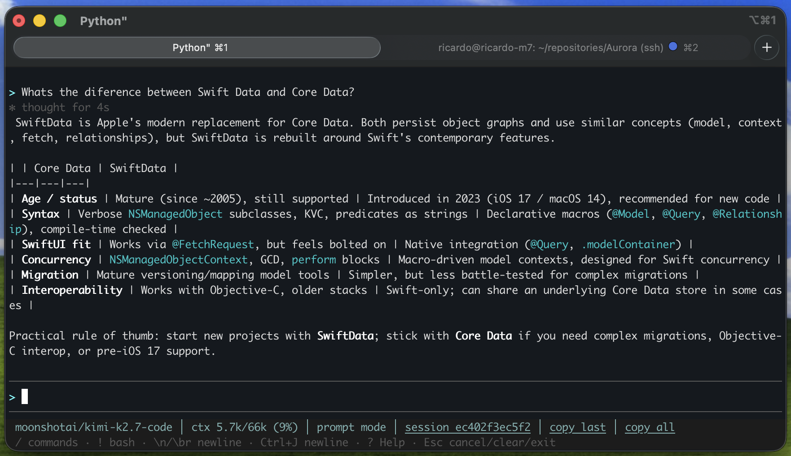

# Aurora


Micro terminal coding agent — OpenRouter / a local llama.cpp
server, with a tool loop, approval gates, session logs, and support for the
[`.agentic_context`](https://github.com/ricardopsantos/AgenticContext)
protocol via its MCP server (`agentic_context_mcp`, configured in
`config.yaml`'s `mcp_servers:`).

> A micro terminal coding agent — small enough to read, complete enough to
> use every day. Named after my beautiful two-year-old daughter Aurora,
> always with her hair bow.



## Contents

- [Quick orientation](#quick-orientation)
- [Install](#install-macos-or-linux)
- [Keys](#keys)
- [Run](#run)
- [Daily use](#daily-use)
- [Layout](#layout)
- [Tests](#tests)
- [Other documents](#other-documents)

## Quick orientation

**Start every session oriented** — save a bootstrap prompt once and Aurora
offers to run it at every boot (a good default ships in
[`documents/bootstrap.example.md`](documents/bootstrap.example.md)); see
**[documents/FEATURES.md](documents/FEATURES.md#session-bootstrap)** for how.

**What Aurora gives you, in short:** secret scanning on every prompt and
tool output before it ever reaches the model or a log; every write/edit/
command previewed and approval-gated, with a shadow-git snapshot before
each so `/rewind` can undo any step; one `/model` menu across OpenRouter and
a local llama.cpp server, models added by pasting a URL; prompt caching and
concurrent read-only tool calls so a multi-step task doesn't quietly burn
tokens; a full-screen TUI with streaming markdown, collapsible thinking
blocks and mouse support; resumable/exportable sessions, `/compact`; and a
plain-`.py` extension API (MCP client + lint checker bundled).

Full detail, screenshots and the reasoning behind each — see
**[documents/FEATURES.md](documents/FEATURES.md)**.

## Install (macOS or Linux)

Recommended — one line, runs from anywhere, no manual `cd` into a checkout:

```bash
curl -fsSL https://raw.githubusercontent.com/ricardopsantos/Aurora/main/bootstrap-install.sh | bash
```

Clones into `~/Aurora` (override with `AURORA_DIR=/path ...`), then runs
`install.sh` for you — including, on first install, offering to set up an
API key interactively if none is configured yet. Or do it by hand:

```bash
git clone https://ricardopsantos.org/aurora Aurora
cd Aurora && ./install.sh     # prompts for the data dir (default ~/.aurora)
                               # first run also creates config.yaml from
                               # config.yaml.example if you don't have one yet,
                               # and offers to set up an API key if none is set
```

Machine sync is just `git pull` (then re-run
`./.venv/bin/pip install -e . -q` if dependencies changed). `config.yaml`
holds providers/models/endpoints — some checkouts commit a shared one,
others gitignore it as machine-specific; either way, `./install.sh` creates
it from `config.yaml.example` if it's missing. Keys never live in config at
all — always env/keyring, via `aurora key set`.

## Keys

```bash
aurora key set                    # LLAMA_API_KEY (default)
aurora key set OPENROUTER_API_KEY  # openrouter.ai/keys
aurora key status                 # is a key set, and where from?
```

No OpenRouter key? Aurora still works — only the paid remote models are
unusable; pick your local model with `/model`. Full key table, `key_fetch:`
and `aurora wipe` — see **[documents/KEYS.md](documents/KEYS.md)**.

## Run

```bash
aurora                # start in the current project (knows nothing until you /bootstrap)
aurora --continue     # resume the last session
aurora --resume ID    # resume a specific session
aurora --classic      # inline REPL instead of the full-screen TUI
aurora my-config.yaml # alternate config
aurora --man          # full man-style manual
```

## Daily use

The essentials — full command table, the status bar layout, and the Esc
double-tap control rule are in
**[documents/COMMANDS.md](documents/COMMANDS.md)**.

| Input | Action |
|---|---|
| plain text | talk to the model; writes/commands ask approval first |
| `/model` | switch between OpenRouter and local models |
| `/cost` · `/context [id]` | spend across all sessions · this session's cost tree |
| `/compact` · `/clear` · `/reset` | summarize-and-continue · start fresh · full reset |
| `/rewind [id]` | list/restore a pre-edit checkpoint |
| `/resume` · `/search <text>` | pick a past session · find one by content |
| **Esc** (twice) | the control key — cancel/leave-mode/quit, see below |
| **?** or `/help` | open the help menu |

## Layout

Engine (state, providers, tools, agent loop) and UI (prompt_toolkit REPL) are
strictly split — the only contract is `aurora/frontend.py`'s `Frontend`
protocol, and `tests/test_architecture.py` enforces the boundary. Swap the UI
(HTML, websocket) by implementing `Frontend`; the engine is untouched. Full
writeup: **[documents/ARCHITECTURE.md](documents/ARCHITECTURE.md)**.

## Tests

```bash
./.venv/bin/python -m pytest -q
```

## Other documents

Everything below `README.md` lives in **[documents/](documents/)**:

- **[CHANGELOG_TECHNICAL.md](documents/CHANGELOG_TECHNICAL.md)** — the
  canonical spec: every numbered requirement (R1+, currently through R217),
  build plan and test plan, written before the code and kept in sync with
  behaviour. When any doc disagrees with it, this one wins. (Formerly
  `AURORA.md`.)
- **[ARCHITECTURE.md](documents/ARCHITECTURE.md)** — the *how*: engine/UI
  boundary, module map, data flow, threading, persistence.
- **[FEATURES.md](documents/FEATURES.md)** — full feature writeups with
  screenshots.
- **[COMMANDS.md](documents/COMMANDS.md)** — the full daily-use command
  table, status bar layout, and the Esc double-tap rule.
- **[KEYS.md](documents/KEYS.md)** — the full key table and `key_fetch:`.
- **[LOCAL_MODEL_NOTES.md](documents/LOCAL_MODEL_NOTES.md)** — running
  against a local llama.cpp server.
- **[EXTENSIONS.md](documents/EXTENSIONS.md)** — writing a `.py` tool
  extension.
- **[REQUIREMENTS_OVERVIEW.md](documents/REQUIREMENTS_OVERVIEW.md)** — a
  short, stable high-level index into `CHANGELOG_TECHNICAL.md`'s requirement
  groups. (Formerly `REQUIREMENTS.md`.)
- **[CHANGELOG.md](documents/CHANGELOG.md)** — human-readable release notes
  (not to be confused with `CHANGELOG_TECHNICAL.md` above).
- **[bootstrap.example.md](documents/bootstrap.example.md)** — the default
  session-start bootstrap prompt.

**Rule: README, `CHANGELOG_TECHNICAL.md` and `ARCHITECTURE.md` must stay in
sync with the code — any behaviour change ships with its doc update in the
same commit.**
