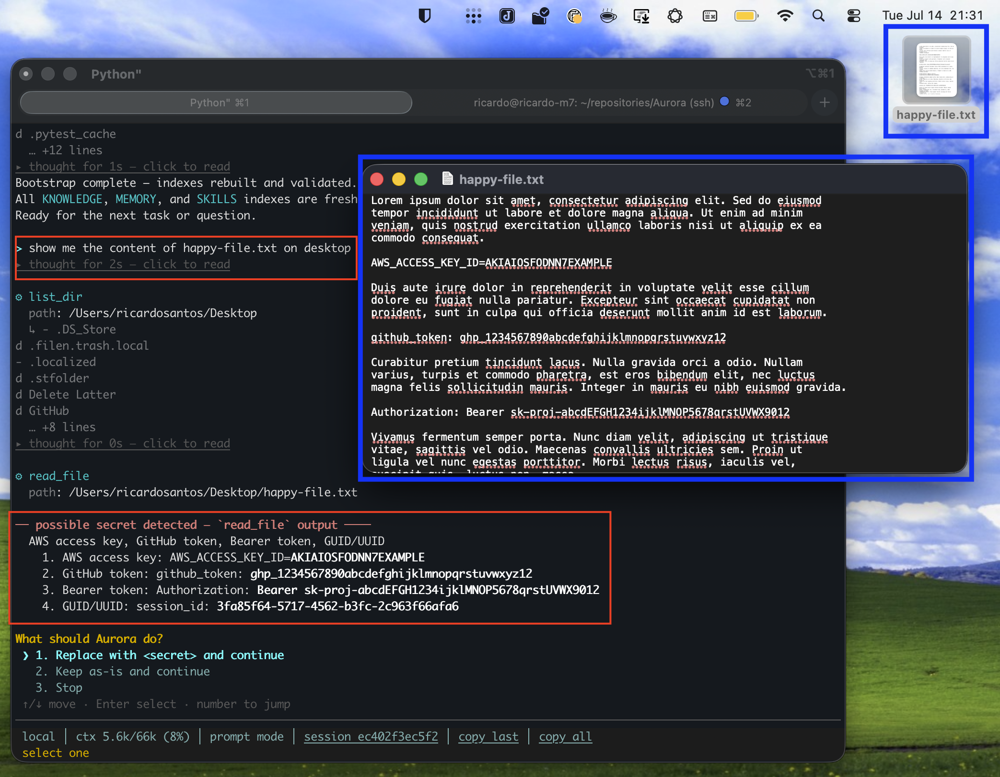
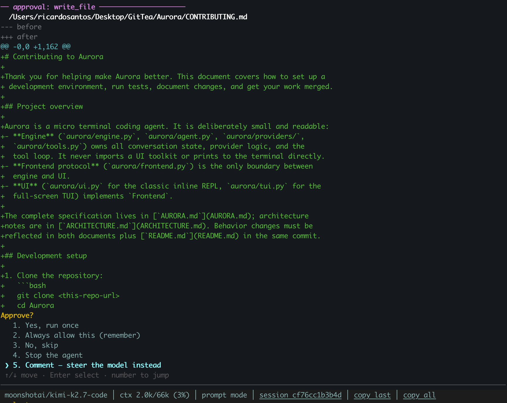
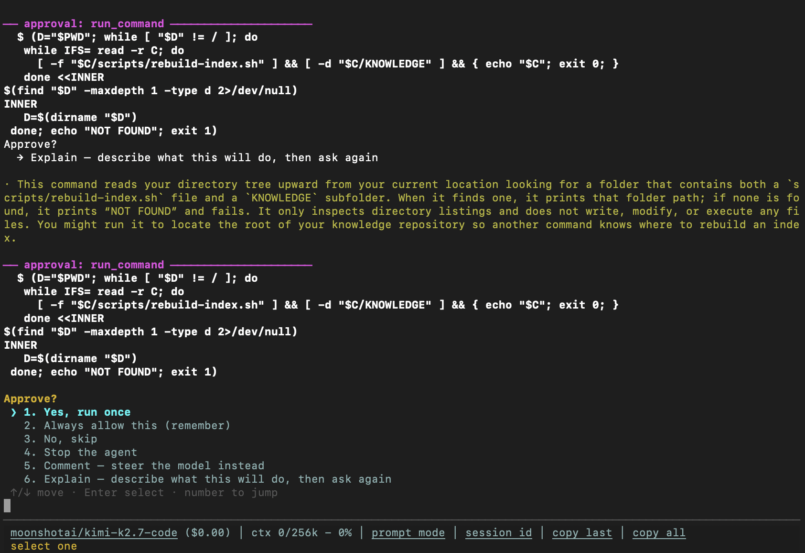
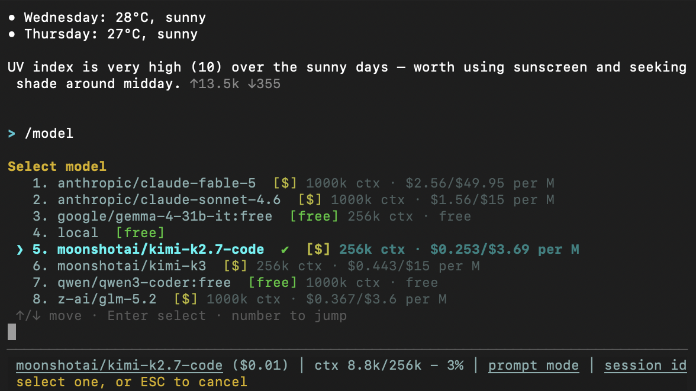
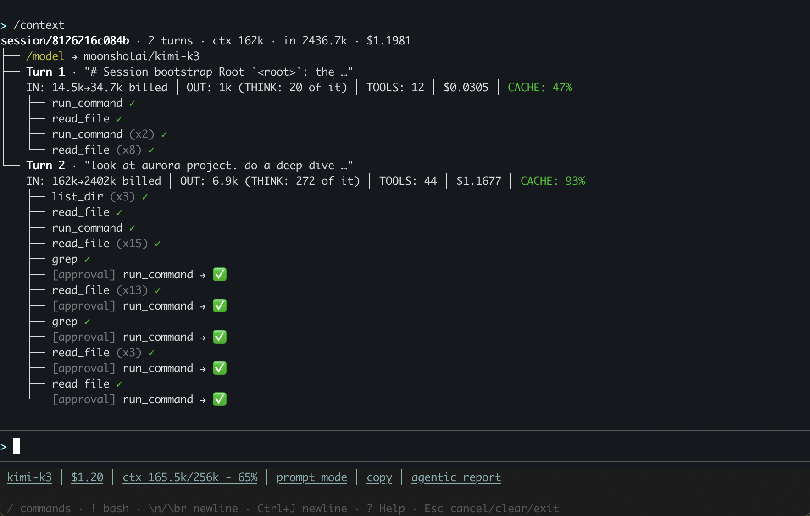
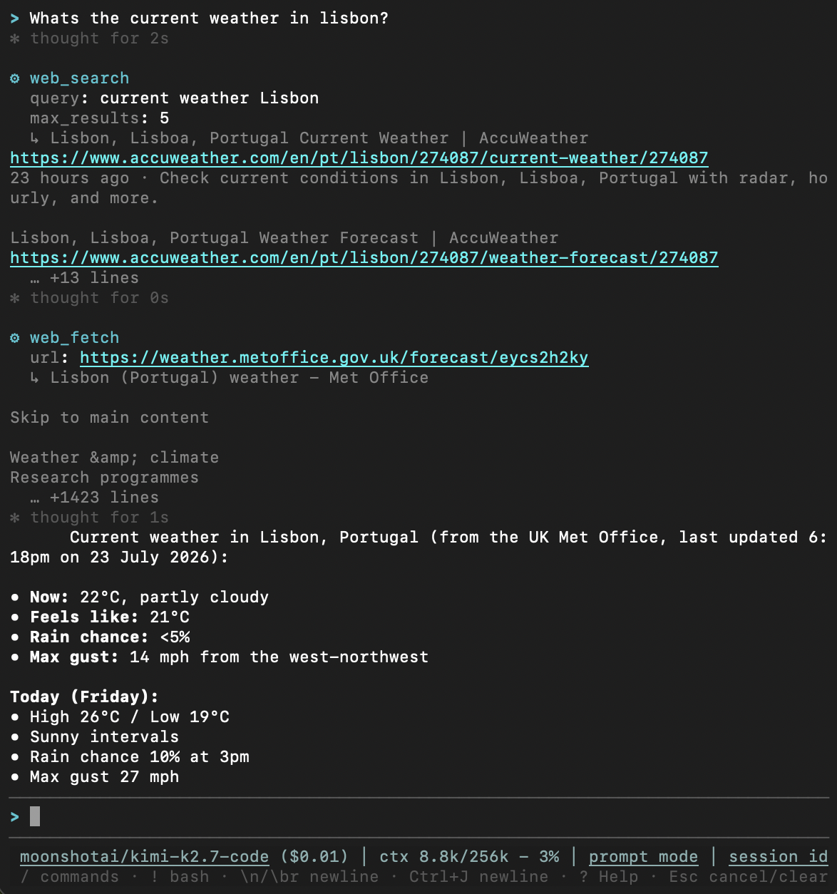

# Aurora — Features

Full detail behind the [README](../README.md)'s feature summary.

## Session bootstrap

**Start every session oriented.** Save a bootstrap prompt once and Aurora
offers to run it at every boot — the repo ships a good default
([`bootstrap.example.md`](bootstrap.example.md)): read the README and rules
files, bootstrap
[`.agentic_context/`](https://github.com/ricardopsantos/AgenticContext) if
present, check the git state, and report a short brief before touching
anything.

```
/bootstrap set documents/bootstrap.example.md            # global default
/bootstrap set documents/bootstrap.example.md project    # just this project (.aurora/bootstrap.md)
```

**Privacy & security at the core**
- Every prompt and every tool output (even read-only ones like
  `read_file`/`grep`) is scanned for API keys, tokens, and credentials
  before it reaches the model or the session log. A match challenges you:
  redact it, keep it, allow it going forward, or stop.
- API keys never touch disk in plaintext — OS keyring or encrypted storage
  only.



**Approval-gated, steerable edits**
- Every file write, edit or shell command shows a diff preview and asks
  first; trusted patterns can be allowlisted.
- Don't just allow or deny — pick "Comment" and type a note instead;
  Aurora folds it into the same request and redoes the change, no
  deny → re-explain → re-approve round trip.
- A shadow git snapshot is taken before every approved change, so
  `/rewind` can undo any step — even the rewind itself.



Picking "Explain" instead describes what the pending call will actually do,
in plain English, before asking again — useful for a command you don't
immediately recognize:



**Any model, zero friction**
- `/model` switches between OpenRouter (paid) and your local server —
  llama.cpp, or Ollama via a `type: ollama` provider entry — free, from the
  same arrow-key menu. Current model marked; no key stored yet? it asks once
  and remembers (a local server usually needs none at all).
- Adding one is as simple as pasting its OpenRouter URL:
  `/model add https://openrouter.ai/kwaipilot/kat-coder-air-v2.5` (or just
  the bare `org/model` id) validates it against the OpenRouter catalog,
  fetches its context size, pricing and description, and asks for your
  `OPENROUTER_API_KEY` if it isn't stored yet — no config editing.
  `/model remove` drops one just as easily. (Automatic model config is
  OpenRouter-only for now.)



**Doesn't waste your tokens**
- The system prompt (your rules, indexes and `[CORE]` docs) is marked as
  cacheable, so a long preamble isn't re-billed on every tool iteration of
  every turn — which is where a multi-step task quietly spends most of its
  money. `/cost` shows the per-model breakdown, cache hits included.
- A round's read-only calls — reads, greps, fetches — run at once instead of
  one after another. Approvals, ordering and the transcript are unchanged;
  only the waiting overlaps.
- Tools that reach what you meant: `grep` takes real regex, `read_file`
  takes a line range, so the model narrows in instead of re-reading the
  same file head.

```
> /cost
token usage — all sessions
  local
    1 turn · in 500 · out 80 · no price
  moonshotai/kimi-k2.7-code
    1 turn · in 41k · out 1.2k · $0.0148  32k cached
  total  $0.0148
```

`in` is the *billed* prompt total — every tool iteration of a turn pays for
the whole context, which is exactly why the caching matters. Prices come
from a per-model table you can edit; a model with no entry says "no price"
rather than a `$0.00` that would imply it was free.

`/context` breaks the same numbers down per turn instead of per model —
every tool call, approval, and cache hit rate for one session:



**Built for daily terminal use**
- Full-screen TUI: scrollable chat with streaming markdown — including
  keyword/string/number syntax highlighting inside fenced code blocks for a
  curated set of languages (python, js/ts, bash, go, rust, ruby) — timed
  collapsible thinking blocks, mouse support and drag-to-copy — with a
  classic REPL fallback for plain terminals.
- Resume past conversations, export them as markdown, or `/compact` long
  ones into a summary.
- Reusable prompt-driven skills, plus a per-project bootstrap prompt so
  the agent starts every session already knowing the codebase.
- **[Extensions](EXTENSIONS.md)**: drop a `.py` file into
  `~/.aurora/extensions/` and its tools become callable by the model — no
  new API, just the same `SPEC`/`RUNNERS` shape Aurora's own built-in tools
  use. Ships with four bundled by default: `web_search`/`web_fetch` (a
  search API + page fetch, so the model can look things up instead of
  guessing), an MCP (Model Context Protocol) client — point `config.yaml`'s
  `mcp_servers:` at any stdio MCP server and its tools show up alongside
  Aurora's own, gated by the same approval prompt as every write/command —
  `lint_check`, which runs `ruff` (Python) against a file the model just
  wrote or edited, and `refresh_model_prices`, which re-pulls every
  configured OpenRouter model's price and context size from the catalog on
  demand.
- Approval policy has a third option beyond allow/ask: pick "Always DENY
  this" from any approval prompt (or hand-edit `denylist.yaml`) to block a
  pattern permanently, no question asked again — `/denylist` reviews it.
- **"Always allow" generalizes by how risky the command is, not uniformly.**
  A read-only command (`find`, `ls`, `grep`, …) generalizes across any
  arguments, so approving `find /a` also covers `find /b` next session —
  *except* when the invocation uses one of that command's own mutating
  flags. "Read-only" is a claim about the command NAME, and for `find` it
  only holds for how `find` is normally called: the binary also ships
  `-delete`, `-exec`, `-fprintf` and friends. Such a call is treated as
  destructive and generalizes across nothing, so an "always allow" on a
  routine `find . -name '*.log'` cannot later wave through `find / -delete`.
  A destructive one — `dd`, `rm`, `mkfs`, `shred`, `sudo`, `sh`/`bash`/
  `python`, `curl`/`wget` and friends — generalizes across **none**: the
  rule matches that exact command string and nothing else, so approving
  `rm -rf ./build` never lets `rm -rf /` through unasked. Anything with a
  shell operator (`&&`, `|`, `>`, backtick, `$(`) is likewise exact-match
  only. Everything in between stores a two-token prefix (`git push`).


